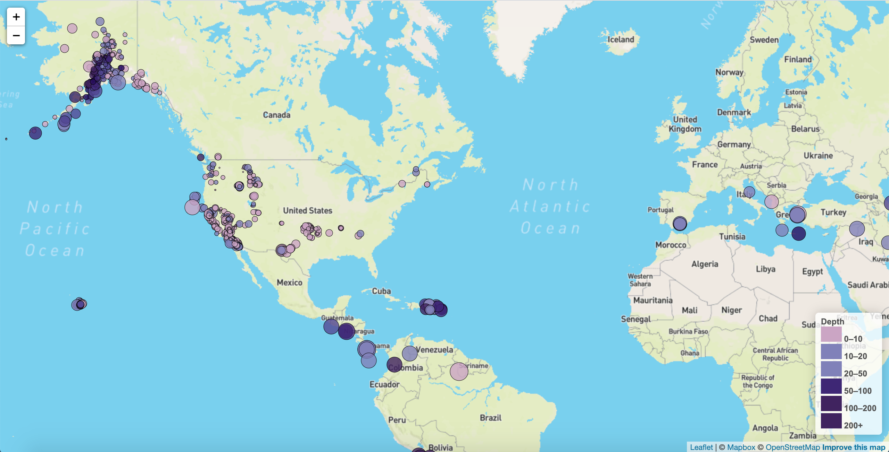

# Leaflet Challege
## Project Summary

* The goal of this project was to create an interactive visualization based off of USGS earthquake data. The map had the following attributes:
  * Markers with sizes based off of magnitude and colors based off of depth
  * A legend describing the marker sizes

## Technologies Used

* JavaScript - Leaflet
* HTML
* CSS

## The Process

* An API query was essential as it returned the data from the geojson. The geojson included the location, depth, and magnitude data that was used as the basis for the markers. A popup for each marker was created using the query. The radius varied for each marker based off the magnitude.
* A switch function was used to help categorize the depth data. This was visualized through the different colors applied to the marker categories.

## The Final Product: An Interactive Website
* Interactive Map:
 
